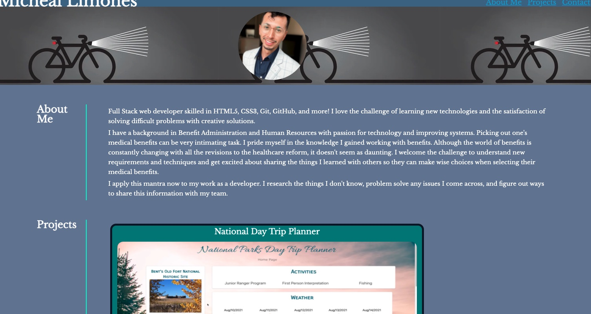

# Updated-Limones-Portfolio

Here is my updated portfolio created to provide potential employers with some information about myself and my background, examples of projects I have completed, and some links on how they may contact me.

This portfolio uses HTML and CSS. I have include some responsive design so viewers may access my page using different device sizes.

link to the deploy application: https://michlimones.github.io/Updated-Limones-Portfolio/
